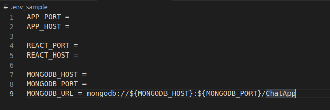
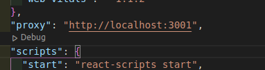

# Chat App

Chat App with FARM stack (FastAPI + mongoDB + React)!

# Setup

This app needs Python, Node.js and mongoDB.

Generate a _.env_ and fill it with the environment variables (sample at _.env_sample_):

Add the proxy to your backend server at _frontend/package.json_:

Navigate to backend folder and execute:

`$ cd backend`

Create a virtual environment:

`$ python -m venv venv`

`$ source venv/bin/activate`

`$ pip install -r requirements.txt`

Run backend server:

`$ python main.py`

Navigate to frontend folder and execute:

`$ cd frontend`

`$ npm install`

`$ npm start`

You can test endpoints by using Swagger UI (for example: http://localhost:3001/docs) or using Postman.

# TODO

- Create Chatroom backend logic
- Create Frontend for Chatroom creation
- Take a look at python-socketio https://github.com/miguelgrinberg/python-socketio
- Implement socketio for multiple browser chatroom
- Add schemas to mongoDB to ensure uniqueness of usernames, chatroom names, etc.
- ...
